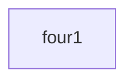

# FOUR1 -- Fourier Transform

## 1. Overview

| Field | Value |
|-------|-------|
| **Example** | `four1` |
| **Chapter** | 12 -- Fourier Transform |
| **Purpose** | Cooley-Tukey radix-2 FFT for complex data (in-place, interleaved real/imag). |
| **Status** | `converted` |
| **Complexity** | `medium` |
| **Fortran LOC** | 50 |
| **Subroutine** | `FOUR1` (subroutine) |

## 2. Source Files

- **Fortran source:** `fortran/12_fourier_transform/four1/four1.f` (50 lines)
- **Driver/demo:** `fortran/12_fourier_transform/four1/four1.dem`
- **Target:** `matarized/12_fourier_transform/four1/`


## 3. Dependency Graph

### Forward Dependencies (this example depends on)

  (none)

### Diagram



### Cross-Chapter Dependencies

(none)

## 4. Reverse Dependencies (examples that depend on this)

  - `cosft` (12_fourier_transform)
  - `realft` (12_fourier_transform)
  - `sinft` (12_fourier_transform)
  - `twofft` (12_fourier_transform)
  - `convlv` (13_spectral_analysis)
  - `correl` (13_spectral_analysis)
  - `smooft` (13_spectral_analysis)
  - `spctrm` (13_spectral_analysis)

> **Conversion note:** This routine is depended on by 8 other examples and should be converted early.

## 5. Fortran Variable Catalog

| Name | Fortran Type | Shape | Role | MATAR Type | Notes |
|------|-------------|-------|------|-----------|-------|
| `DATA` | `REAL` | * | parameter (input) | `DFMatrixKokkos<double>(*)` |  |
| `ISIGN` | `INTEGER` | (scalar) | parameter (input) | `int` |  |
| `NN` | `INTEGER` | (scalar) | parameter (input) | `int` |  |
| `THETA` | `REAL*8` | (scalar) | local | `double` |  |
| `WI` | `REAL*8` | (scalar) | local | `double` |  |
| `WPI` | `REAL*8` | (scalar) | local | `double` |  |
| `WPR` | `REAL*8` | (scalar) | local | `double` |  |
| `WR` | `REAL*8` | (scalar) | local | `double` |  |
| `WTEMP` | `REAL*8` | (scalar) | local | `double` |  |

### MATAR Type Mapping Rationale

- **Layout:** `FMatrix` (column-major) preserves Fortran memory layout for correctness.
- **Index base:** `Matrix` (1-based) matches Fortran indexing with `DO_ALL` inclusive ranges.
- **Residence:** `Dual` (`DFMatrixKokkos`) enables both host I/O and device computation.
- **Ownership:** Owning types at call site; consider `ViewFMatrix` for sub-array slices.

## 6. Compute Kernel Analysis

### K1: DO 11  I=1,N, step 2  (bit-reversal permutation)

- **Thread safety:** `inherently_serial` in Fortran; `safe` after restructuring
- **Recommended macro:** `FOR_ALL` (after restructuring)
- **Notes:** The Fortran code uses a sequential bit-reversal recurrence (J tracks the reversed index). This is **not parallelizable as-is**. **Fix:** Compute the bit-reversed index directly per thread using a log2(NN)-step loop. Guard swaps with `rev > ci` to avoid double-swapping. See the existing `four1.hpp` conversion. After restructuring: embarrassingly parallel.

### K2: DO 13  M=1,MMAX, step 2  (twiddle factor computation, per stage)

- **Thread safety:** `inherently_serial` in Fortran; `safe` after restructuring
- **Recommended macro:** `FOR_ALL` (precompute twiddle array)
- **Notes:** Fortran computes twiddle factors via sequential recurrence (WR,WI updated each step). **Fix:** Precompute twiddle factors into a `CArrayKokkos` array using `cos`/`sin` directly per index in a `FOR_ALL`. See the existing `four1.hpp` conversion.

### K3: DO 12  I=M,N, step ISTEP  (butterfly operations)

- **Thread safety:** `safe` (within a single stage)
- **Recommended macro:** `FOR_ALL`
- **Notes:** Within one butterfly stage, no two butterflies share array elements (each butterfly operates on a disjoint pair of indices). **Strategy:** Flatten the (group, twiddle_index) space into a 1D `FOR_ALL` dispatch. Each thread computes its unique (i, j) butterfly pair from its flat index. Requires a `MATAR_FENCE()` between consecutive butterfly stages. See the existing `four1.hpp` conversion.


### Thread-Safety Legend

| Classification | Meaning | Action |
|---------------|---------|--------|
| `safe` | No write conflicts | Parallelize directly with `DO_ALL` |
| `reduction` | Accumulation to scalar | Use `DO_REDUCE_SUM` / `DO_REDUCE_MAX` |
| `unsafe_review` | Potential race condition | Restructure: inner serial loop or phased approach |
| `inherently_serial` | Sequential data dependency | Keep as serial `for` inside parallel region |

## 7. Conversion Strategy

### Proposed C++ Signature

```cpp
inline void four1(DFMatrixKokkos<double>& data, int nn, int isign)
```

### Output Format

- **.hpp header** (included by other examples via `#include`)

### Steps

1. **Translate data structures** -- replace Fortran arrays with `DFMatrixKokkos` (see variable catalog below)
2. **Translate routine** -- convert `FOUR1` to a C++ function as a `.hpp header`
3. **Replace loops** -- convert DO loops to `DO_ALL` / `DO_REDUCE_*` macros (see kernel analysis below)
4. **Add synchronization** -- insert `MATAR_FENCE()` between dependent kernels; add `update_host()`/`update_device()` for Dual types
5. **Create driver** -- translate the `.dem` test program to `main.cpp` with `MATAR_INITIALIZE` / `MATAR_FINALIZE` boilerplate
6. **Generate CMakeLists.txt** -- use the template below (based on convlv reference)
7. **Validate** -- follow the validation plan below

## 8. CMake Configuration

Based on the [convlv CMakeLists.txt](../../13_spectral_analysis/convlv/CMakeLists.txt) reference template.

```cmake
cmake_minimum_required(VERSION 3.18)
project(four1_matar_parallel CXX)

set(CMAKE_CXX_STANDARD 17)
set(CMAKE_CXX_STANDARD_REQUIRED ON)

include(FetchContent)

# --- Kokkos backend selection (Serial is always on) ---
set(Kokkos_ENABLE_SERIAL ON CACHE BOOL "Enable Kokkos serial backend")

option(ENABLE_OPENMP "Enable OpenMP backend" OFF)
option(ENABLE_CUDA   "Enable CUDA backend"   OFF)
option(ENABLE_HIP    "Enable HIP backend"    OFF)

if(ENABLE_OPENMP)
    set(Kokkos_ENABLE_OPENMP ON CACHE BOOL "")
endif()
if(ENABLE_CUDA)
    set(Kokkos_ENABLE_CUDA        ON CACHE BOOL "")
    set(Kokkos_ENABLE_CUDA_LAMBDA ON CACHE BOOL "")
endif()
if(ENABLE_HIP)
    set(Kokkos_ENABLE_HIP ON CACHE BOOL "")
endif()

# --- Fetch Kokkos ---
FetchContent_Declare(
    kokkos
    GIT_REPOSITORY https://github.com/kokkos/kokkos.git
    GIT_TAG        4.5.01
    GIT_SHALLOW    TRUE
)
FetchContent_MakeAvailable(kokkos)

# --- Fetch MATAR (header-only -- bypass its CMakeLists.txt) ---
FetchContent_Declare(
    matar
    GIT_REPOSITORY https://github.com/lanl/MATAR.git
    GIT_TAG        main
    GIT_SHALLOW    TRUE
)
FetchContent_GetProperties(matar)
if(NOT matar_POPULATED)
    FetchContent_Populate(matar)
endif()

add_library(matar_lib INTERFACE)
target_include_directories(matar_lib INTERFACE ${matar_SOURCE_DIR}/src/include)
target_link_libraries(matar_lib INTERFACE Kokkos::kokkos)
target_compile_definitions(matar_lib INTERFACE HAVE_KOKKOS=1)

# --- Cross-chapter dependency headers ---
set(MATARIZED_ROOT ${CMAKE_CURRENT_SOURCE_DIR}/../..)


# --- Build the FOUR1 example ---
add_executable(four1 main.cpp)
target_link_libraries(four1 matar_lib)

```

## 9. Performance Improvements

- **FMatrix to CArray migration:** The initial translation uses `DFMatrixKokkos` (column-major, 1-based) for Fortran compatibility.  For GPU targets, converting to `DCArrayKokkos` (row-major, 0-based) with reordered loops will improve coalesced memory access.
- **Loop ordering:** Verify innermost parallel index matches the fastest-varying array dimension for the chosen layout.
- **Reduction fusion:** If multiple reductions share the same loop bounds, consider fusing them into a single pass to reduce kernel launch overhead.
- **Fence elimination:** After conversion, audit `MATAR_FENCE()` placement.  Remove fences between independent kernels that do not share data.
- **Hierarchical parallelism:** For deeply nested loops, consider `FOR_FIRST`/`FOR_SECOND` team-thread decomposition for better occupancy.

## 10. Validation Plan

### Reference Output

Build and run the Fortran version to capture reference output:

```bash
cd fortran/12_fourier_transform/four1
make run > reference_output.txt 2>&1
```


### Serial Validation

```bash
cd matarized/12_fourier_transform/four1
mkdir -p build && cd build
cmake .. && make
./four1 > serial_output.txt 2>&1
diff <(head -50 serial_output.txt) <(head -50 ../../../../fortran/12_fourier_transform/four1/reference_output.txt)
```


### Parallel Validation (OpenMP)

```bash
cd matarized/12_fourier_transform/four1
mkdir -p build-omp && cd build-omp
cmake .. -DENABLE_OPENMP=ON && make
OMP_NUM_THREADS=1 ./four1 > omp1_output.txt 2>&1
OMP_NUM_THREADS=4 ./four1 > omp4_output.txt 2>&1
# Verify: omp1 output must exactly match serial output
diff serial_output.txt omp1_output.txt
# Verify: omp4 output must match within floating-point tolerance
```


### Pass Criteria

- Max absolute difference vs. Fortran reference: **< 1e-10** (double precision)

- OpenMP results must be deterministic across repeated runs

- No runtime errors, memory leaks, or Kokkos warnings


## Conversion Audit (Already Converted)

This example has been converted to MATAR. The converted source is at `matarized/12_fourier_transform/four1/four1.hpp` (90 lines).

### Key Design Decisions in Existing Conversion

- **Bit-reversal:** Direct per-thread computation replaces the sequential recurrence. Each thread computes its bit-reversed partner independently using a log2(NN)-step loop. Guard `rev > ci` ensures each pair swapped exactly once.
- **Twiddle factors:** Precomputed into `CArrayKokkos` arrays via `cos`/`sin` per stage, replacing the sequential WR/WI recurrence.
- **Butterfly dispatch:** Each stage's butterflies are flattened into a 1D `FOR_ALL` with `ngroups * half` total work items. Within a stage, butterflies are provably disjoint.
- **Fences:** `MATAR_FENCE()` placed between bit-reversal and butterfly phases, between twiddle precomputation and butterfly dispatch, and between consecutive stages.
- **Data type:** Uses `DFMatrixKokkos<double>` (1-based, column-major) to match Fortran interleaved real/imag layout.

### Remaining Work

- [ ] Create a standalone `main.cpp` driver with test cases from `four1.dem`
- [ ] Add CMakeLists.txt for independent builds
- [ ] Verify numerical accuracy against Fortran reference output

## 11. Agent Metadata

| Field | Value |
|-------|-------|
| **Conversion order** | 8 of 202 |
| **Priority score** | 8 (reverse dependency count) |
| **Estimated effort** | medium (50 Fortran LOC, 0 dependencies) |
| **Prerequisite conversions** | (none -- leaf node) |
| **Tags** | `fourier-transform`, `fft`, `signal-processing`, `leaf` |
| **MATAR reference sections** | Sec 5 (parallel loops), Sec 6 (reductions), Sec 15 (Fortran interop) |
