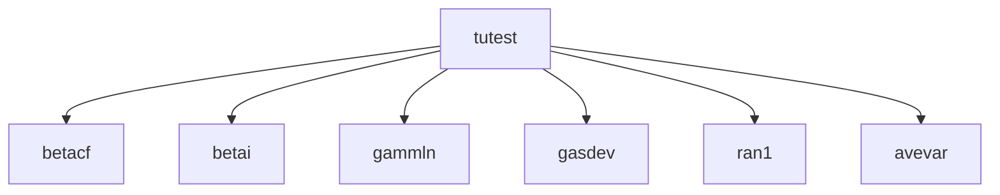

# TUTEST -- Statistics

## 1. Overview

| Field | Value |
|-------|-------|
| **Example** | `tutest` |
| **Chapter** | 14 -- Statistics |
| **Purpose** | Student's t-test for difference of means (unequal variances). |
| **Status** | `not_started` |
| **Complexity** | `high` |
| **Fortran LOC** | 10 |
| **Subroutine** | `TUTEST` (subroutine) |

## 2. Source Files

- **Fortran source:** `fortran/14_statistics/tutest/tutest.f` (10 lines)
- **Driver/demo:** `fortran/14_statistics/tutest/tutest.dem`
- **Target:** `matarized/14_statistics/tutest/`


## 3. Dependency Graph

### Forward Dependencies (this example depends on)

  - `betacf` (06_special_functions)
  - `betai` (06_special_functions)
  - `gammln` (06_special_functions)
  - `gasdev` (07_random_numbers)
  - `ran1` (07_random_numbers)
  - `avevar` (14_statistics)

### Diagram



### Cross-Chapter Dependencies

- `betacf` from chapter 06
- `betai` from chapter 06
- `gammln` from chapter 06
- `gasdev` from chapter 07
- `ran1` from chapter 07

## 4. Reverse Dependencies (examples that depend on this)

  (none)

> **Conversion note:** No other examples depend on this routine.

## 5. Fortran Variable Catalog

| Name | Fortran Type | Shape | Role | MATAR Type | Notes |
|------|-------------|-------|------|-----------|-------|
| `DATA1` | `REAL` | N1 | parameter (input) | `DFMatrixKokkos<double>(N1)` |  |
| `DATA2` | `REAL` | N2 | parameter (input) | `DFMatrixKokkos<double>(N2)` |  |
| `N1` | `INTEGER` | (scalar) | parameter (input) | `int` |  |
| `N2` | `INTEGER` | (scalar) | parameter (input) | `int` |  |
| `PROB` | `REAL` | (scalar) | parameter (input) | `double` |  |
| `T` | `REAL` | (scalar) | parameter (input) | `double` |  |

### MATAR Type Mapping Rationale

- **Layout:** `FMatrix` (column-major) preserves Fortran memory layout for correctness.
- **Index base:** `Matrix` (1-based) matches Fortran indexing with `DO_ALL` inclusive ranges.
- **Residence:** `Dual` (`DFMatrixKokkos`) enables both host I/O and device computation.
- **Ownership:** Owning types at call site; consider `ViewFMatrix` for sub-array slices.

## 6. Compute Kernel Analysis

_No DO loops detected in source._

### Thread-Safety Legend

| Classification | Meaning | Action |
|---------------|---------|--------|
| `safe` | No write conflicts | Parallelize directly with `DO_ALL` |
| `reduction` | Accumulation to scalar | Use `DO_REDUCE_SUM` / `DO_REDUCE_MAX` |
| `unsafe_review` | Potential race condition | Restructure: inner serial loop or phased approach |
| `inherently_serial` | Sequential data dependency | Keep as serial `for` inside parallel region |

## 7. Conversion Strategy

### Proposed C++ Signature

```cpp
inline void tutest(DFMatrixKokkos<double>& data1, int n1, DFMatrixKokkos<double>& data2, int n2, double t, double prob)
```

### Output Format

- **.cpp with main()** (standalone executable)

### Steps

1. **Translate data structures** -- replace Fortran arrays with `DFMatrixKokkos` (see variable catalog below)
2. **Translate routine** -- convert `TUTEST` to a C++ function as a `.cpp with main()`
3. **Replace loops** -- convert DO loops to `DO_ALL` / `DO_REDUCE_*` macros (see kernel analysis below)
4. **Add synchronization** -- insert `MATAR_FENCE()` between dependent kernels; add `update_host()`/`update_device()` for Dual types
5. **Create driver** -- translate the `.dem` test program to `main.cpp` with `MATAR_INITIALIZE` / `MATAR_FINALIZE` boilerplate
6. **Generate CMakeLists.txt** -- use the template below (based on convlv reference)
7. **Validate** -- follow the validation plan below

## 8. CMake Configuration

Based on the [convlv CMakeLists.txt](../../13_spectral_analysis/convlv/CMakeLists.txt) reference template.

```cmake
cmake_minimum_required(VERSION 3.18)
project(tutest_matar_parallel CXX)

set(CMAKE_CXX_STANDARD 17)
set(CMAKE_CXX_STANDARD_REQUIRED ON)

include(FetchContent)

# --- Kokkos backend selection (Serial is always on) ---
set(Kokkos_ENABLE_SERIAL ON CACHE BOOL "Enable Kokkos serial backend")

option(ENABLE_OPENMP "Enable OpenMP backend" OFF)
option(ENABLE_CUDA   "Enable CUDA backend"   OFF)
option(ENABLE_HIP    "Enable HIP backend"    OFF)

if(ENABLE_OPENMP)
    set(Kokkos_ENABLE_OPENMP ON CACHE BOOL "")
endif()
if(ENABLE_CUDA)
    set(Kokkos_ENABLE_CUDA        ON CACHE BOOL "")
    set(Kokkos_ENABLE_CUDA_LAMBDA ON CACHE BOOL "")
endif()
if(ENABLE_HIP)
    set(Kokkos_ENABLE_HIP ON CACHE BOOL "")
endif()

# --- Fetch Kokkos ---
FetchContent_Declare(
    kokkos
    GIT_REPOSITORY https://github.com/kokkos/kokkos.git
    GIT_TAG        4.5.01
    GIT_SHALLOW    TRUE
)
FetchContent_MakeAvailable(kokkos)

# --- Fetch MATAR (header-only -- bypass its CMakeLists.txt) ---
FetchContent_Declare(
    matar
    GIT_REPOSITORY https://github.com/lanl/MATAR.git
    GIT_TAG        main
    GIT_SHALLOW    TRUE
)
FetchContent_GetProperties(matar)
if(NOT matar_POPULATED)
    FetchContent_Populate(matar)
endif()

add_library(matar_lib INTERFACE)
target_include_directories(matar_lib INTERFACE ${matar_SOURCE_DIR}/src/include)
target_link_libraries(matar_lib INTERFACE Kokkos::kokkos)
target_compile_definitions(matar_lib INTERFACE HAVE_KOKKOS=1)

# --- Cross-chapter dependency headers ---
set(MATARIZED_ROOT ${CMAKE_CURRENT_SOURCE_DIR}/../..)
set(SPECIALFUNCTIONS_DIR ${MATARIZED_ROOT}/06_special_functions)
set(RANDOMNUMBERS_DIR    ${MATARIZED_ROOT}/07_random_numbers)
set(STATISTICS_DIR       ${MATARIZED_ROOT}/14_statistics)

# --- Build the TUTEST example ---
add_executable(tutest main.cpp)
target_link_libraries(tutest matar_lib)
target_include_directories(tutest PRIVATE
    ${SPECIALFUNCTIONS_DIR}/betacf
    ${SPECIALFUNCTIONS_DIR}/betai
    ${SPECIALFUNCTIONS_DIR}/gammln
    ${RANDOMNUMBERS_DIR}/gasdev
    ${RANDOMNUMBERS_DIR}/ran1
    ${STATISTICS_DIR}/avevar
)
```

## 9. Performance Improvements

- **FMatrix to CArray migration:** The initial translation uses `DFMatrixKokkos` (column-major, 1-based) for Fortran compatibility.  For GPU targets, converting to `DCArrayKokkos` (row-major, 0-based) with reordered loops will improve coalesced memory access.
- **Fence elimination:** After conversion, audit `MATAR_FENCE()` placement.  Remove fences between independent kernels that do not share data.

## 10. Validation Plan

### Reference Output

Build and run the Fortran version to capture reference output:

```bash
cd fortran/14_statistics/tutest
make run > reference_output.txt 2>&1
```


### Serial Validation

```bash
cd matarized/14_statistics/tutest
mkdir -p build && cd build
cmake .. && make
./tutest > serial_output.txt 2>&1
diff <(head -50 serial_output.txt) <(head -50 ../../../../fortran/14_statistics/tutest/reference_output.txt)
```


### Parallel Validation (OpenMP)

```bash
cd matarized/14_statistics/tutest
mkdir -p build-omp && cd build-omp
cmake .. -DENABLE_OPENMP=ON && make
OMP_NUM_THREADS=1 ./tutest > omp1_output.txt 2>&1
OMP_NUM_THREADS=4 ./tutest > omp4_output.txt 2>&1
# Verify: omp1 output must exactly match serial output
diff serial_output.txt omp1_output.txt
# Verify: omp4 output must match within floating-point tolerance
```


### Pass Criteria

- Max absolute difference vs. Fortran reference: **< 1e-10** (double precision)

- OpenMP results must be deterministic across repeated runs

- No runtime errors, memory leaks, or Kokkos warnings


## 11. Agent Metadata

| Field | Value |
|-------|-------|
| **Conversion order** | 197 of 202 |
| **Priority score** | 0 (reverse dependency count) |
| **Estimated effort** | high (10 Fortran LOC, 6 dependencies) |
| **Prerequisite conversions** | `betacf`, `betai`, `gammln`, `gasdev`, `ran1`, `avevar` |
| **Tags** | `statistics`, `hypothesis-testing`, `cross-chapter` |
| **MATAR reference sections** | Sec 5 (parallel loops), Sec 15 (Fortran interop) |
