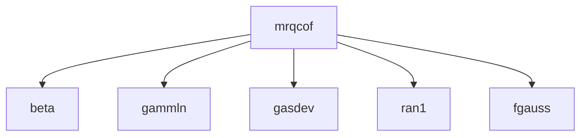

# MRQCOF -- Curve Fitting

## 1. Overview

| Field | Value |
|-------|-------|
| **Example** | `mrqcof` |
| **Chapter** | 15 -- Curve Fitting |
| **Purpose** | Compute the Hessian matrix and gradient vector for Levenberg-Marquardt. |
| **Status** | `not_started` |
| **Complexity** | `high` |
| **Fortran LOC** | 33 |
| **Subroutine** | `MRQCOF` (subroutine) |

## 2. Source Files

- **Fortran source:** `fortran/15_curve_fitting/mrqcof/mrqcof.f` (33 lines)
- **Driver/demo:** `fortran/15_curve_fitting/mrqcof/mrqcof.dem`
- **Target:** `matarized/15_curve_fitting/mrqcof/`


## 3. Dependency Graph

### Forward Dependencies (this example depends on)

  - `beta` (06_special_functions)
  - `gammln` (06_special_functions)
  - `gasdev` (07_random_numbers)
  - `ran1` (07_random_numbers)
  - `fgauss` (15_curve_fitting)

### Diagram



### Cross-Chapter Dependencies

- `beta` from chapter 06
- `gammln` from chapter 06
- `gasdev` from chapter 07
- `ran1` from chapter 07

## 4. Reverse Dependencies (examples that depend on this)

  - `mrqmin` (15_curve_fitting)

> **Conversion note:** This routine is depended on by 1 other examples and should be converted early.

## 5. Fortran Variable Catalog

| Name | Fortran Type | Shape | Role | MATAR Type | Notes |
|------|-------------|-------|------|-----------|-------|
| `A` | `REAL` | MA | parameter (input) | `DFMatrixKokkos<double>(MA)` |  |
| `ALPHA` | `REAL` | NALP, NALP | parameter (input) | `DFMatrixKokkos<double>(NALP, NALP)` |  |
| `BETA` | `REAL` | MA | parameter (input) | `DFMatrixKokkos<double>(MA)` |  |
| `CHISQ` | `REAL` | (scalar) | parameter (input) | `double` |  |
| `DYDA` | `REAL` | MMAX | local | `DFMatrixKokkos<double>(MMAX)` |  |
| `FUNCS` | `REAL` | (scalar) | parameter (input) | `double` |  |
| `LISTA` | `INTEGER` | MFIT | parameter (input) | `DFMatrixKokkos<int>(MFIT)` |  |
| `MA` | `INTEGER` | (scalar) | parameter (input) | `int` |  |
| `MFIT` | `INTEGER` | (scalar) | parameter (input) | `int` |  |
| `MMAX` | `INTEGER` | (scalar) | constant | `constexpr int MMAX = 20;` | constant = 20 |
| `NALP` | `INTEGER` | (scalar) | parameter (input) | `int` |  |
| `NDATA` | `INTEGER` | (scalar) | parameter (input) | `int` |  |
| `SIG` | `REAL` | NDATA | parameter (input) | `DFMatrixKokkos<double>(NDATA)` |  |
| `X` | `REAL` | NDATA | parameter (input) | `DFMatrixKokkos<double>(NDATA)` |  |
| `Y` | `REAL` | NDATA | parameter (input) | `DFMatrixKokkos<double>(NDATA)` |  |

### MATAR Type Mapping Rationale

- **Layout:** `FMatrix` (column-major) preserves Fortran memory layout for correctness.
- **Index base:** `Matrix` (1-based) matches Fortran indexing with `DO_ALL` inclusive ranges.
- **Residence:** `Dual` (`DFMatrixKokkos`) enables both host I/O and device computation.
- **Ownership:** Owning types at call site; consider `ViewFMatrix` for sub-array slices.

## 6. Compute Kernel Analysis

### K1: DO 12  J=1,MFIT

- **Thread safety:** `reduction`
- **Recommended macro:** `DO_REDUCE_SUM`
- **Notes:** Accumulates: CHISQ

### K2: DO 11  K=1,J

- **Thread safety:** `reduction`
- **Recommended macro:** `DO_REDUCE_SUM`
- **Notes:** Accumulates: CHISQ

### K3: DO 15  I=1,NDATA

- **Thread safety:** `reduction`
- **Recommended macro:** `DO_REDUCE_SUM`
- **Notes:** Accumulates: CHISQ

### K4: DO 14  J=1,MFIT

- **Thread safety:** `reduction`
- **Recommended macro:** `DO_REDUCE_SUM`
- **Notes:** Accumulates: CHISQ

### K5: DO 13  K=1,J

- **Thread safety:** `reduction`
- **Recommended macro:** `DO_REDUCE_SUM`
- **Notes:** Accumulates: CHISQ

### K6: DO 17  J=2,MFIT

- **Thread safety:** `reduction`
- **Recommended macro:** `DO_REDUCE_SUM`
- **Notes:** Accumulates: CHISQ

### K7: DO 16  K=1,J-1

- **Thread safety:** `reduction`
- **Recommended macro:** `DO_REDUCE_SUM`
- **Notes:** Accumulates: CHISQ


### Thread-Safety Legend

| Classification | Meaning | Action |
|---------------|---------|--------|
| `safe` | No write conflicts | Parallelize directly with `DO_ALL` |
| `reduction` | Accumulation to scalar | Use `DO_REDUCE_SUM` / `DO_REDUCE_MAX` |
| `unsafe_review` | Potential race condition | Restructure: inner serial loop or phased approach |
| `inherently_serial` | Sequential data dependency | Keep as serial `for` inside parallel region |

## 7. Conversion Strategy

### Proposed C++ Signature

```cpp
inline void mrqcof(DFMatrixKokkos<double>& x, DFMatrixKokkos<double>& y, DFMatrixKokkos<double>& sig, int ndata, DFMatrixKokkos<double>& a, int ma, DFMatrixKokkos<double>& lista, int mfit, DFMatrixKokkos<double>& alpha, DFMatrixKokkos<double>& beta, int nalp, double chisq, double funcs)
```

### Output Format

- **.hpp header** (included by other examples via `#include`)

### Steps

1. **Translate data structures** -- replace Fortran arrays with `DFMatrixKokkos` (see variable catalog below)
2. **Translate routine** -- convert `MRQCOF` to a C++ function as a `.hpp header`
3. **Replace loops** -- convert DO loops to `DO_ALL` / `DO_REDUCE_*` macros (see kernel analysis below)
4. **Add synchronization** -- insert `MATAR_FENCE()` between dependent kernels; add `update_host()`/`update_device()` for Dual types
5. **Create driver** -- translate the `.dem` test program to `main.cpp` with `MATAR_INITIALIZE` / `MATAR_FINALIZE` boilerplate
6. **Generate CMakeLists.txt** -- use the template below (based on convlv reference)
7. **Validate** -- follow the validation plan below

## 8. CMake Configuration

Based on the [convlv CMakeLists.txt](../../13_spectral_analysis/convlv/CMakeLists.txt) reference template.

```cmake
cmake_minimum_required(VERSION 3.18)
project(mrqcof_matar_parallel CXX)

set(CMAKE_CXX_STANDARD 17)
set(CMAKE_CXX_STANDARD_REQUIRED ON)

include(FetchContent)

# --- Kokkos backend selection (Serial is always on) ---
set(Kokkos_ENABLE_SERIAL ON CACHE BOOL "Enable Kokkos serial backend")

option(ENABLE_OPENMP "Enable OpenMP backend" OFF)
option(ENABLE_CUDA   "Enable CUDA backend"   OFF)
option(ENABLE_HIP    "Enable HIP backend"    OFF)

if(ENABLE_OPENMP)
    set(Kokkos_ENABLE_OPENMP ON CACHE BOOL "")
endif()
if(ENABLE_CUDA)
    set(Kokkos_ENABLE_CUDA        ON CACHE BOOL "")
    set(Kokkos_ENABLE_CUDA_LAMBDA ON CACHE BOOL "")
endif()
if(ENABLE_HIP)
    set(Kokkos_ENABLE_HIP ON CACHE BOOL "")
endif()

# --- Fetch Kokkos ---
FetchContent_Declare(
    kokkos
    GIT_REPOSITORY https://github.com/kokkos/kokkos.git
    GIT_TAG        4.5.01
    GIT_SHALLOW    TRUE
)
FetchContent_MakeAvailable(kokkos)

# --- Fetch MATAR (header-only -- bypass its CMakeLists.txt) ---
FetchContent_Declare(
    matar
    GIT_REPOSITORY https://github.com/lanl/MATAR.git
    GIT_TAG        main
    GIT_SHALLOW    TRUE
)
FetchContent_GetProperties(matar)
if(NOT matar_POPULATED)
    FetchContent_Populate(matar)
endif()

add_library(matar_lib INTERFACE)
target_include_directories(matar_lib INTERFACE ${matar_SOURCE_DIR}/src/include)
target_link_libraries(matar_lib INTERFACE Kokkos::kokkos)
target_compile_definitions(matar_lib INTERFACE HAVE_KOKKOS=1)

# --- Cross-chapter dependency headers ---
set(MATARIZED_ROOT ${CMAKE_CURRENT_SOURCE_DIR}/../..)
set(SPECIALFUNCTIONS_DIR ${MATARIZED_ROOT}/06_special_functions)
set(RANDOMNUMBERS_DIR    ${MATARIZED_ROOT}/07_random_numbers)
set(CURVEFITTING_DIR     ${MATARIZED_ROOT}/15_curve_fitting)

# --- Build the MRQCOF example ---
add_executable(mrqcof main.cpp)
target_link_libraries(mrqcof matar_lib)
target_include_directories(mrqcof PRIVATE
    ${SPECIALFUNCTIONS_DIR}/beta
    ${SPECIALFUNCTIONS_DIR}/gammln
    ${RANDOMNUMBERS_DIR}/gasdev
    ${RANDOMNUMBERS_DIR}/ran1
    ${CURVEFITTING_DIR}/fgauss
)
```

## 9. Performance Improvements

- **FMatrix to CArray migration:** The initial translation uses `DFMatrixKokkos` (column-major, 1-based) for Fortran compatibility.  For GPU targets, converting to `DCArrayKokkos` (row-major, 0-based) with reordered loops will improve coalesced memory access.
- **Loop ordering:** Verify innermost parallel index matches the fastest-varying array dimension for the chosen layout.
- **Reduction fusion:** If multiple reductions share the same loop bounds, consider fusing them into a single pass to reduce kernel launch overhead.
- **Fence elimination:** After conversion, audit `MATAR_FENCE()` placement.  Remove fences between independent kernels that do not share data.
- **Hierarchical parallelism:** For deeply nested loops, consider `FOR_FIRST`/`FOR_SECOND` team-thread decomposition for better occupancy.

## 10. Validation Plan

### Reference Output

Build and run the Fortran version to capture reference output:

```bash
cd fortran/15_curve_fitting/mrqcof
make run > reference_output.txt 2>&1
```


### Serial Validation

```bash
cd matarized/15_curve_fitting/mrqcof
mkdir -p build && cd build
cmake .. && make
./mrqcof > serial_output.txt 2>&1
diff <(head -50 serial_output.txt) <(head -50 ../../../../fortran/15_curve_fitting/mrqcof/reference_output.txt)
```


### Parallel Validation (OpenMP)

```bash
cd matarized/15_curve_fitting/mrqcof
mkdir -p build-omp && cd build-omp
cmake .. -DENABLE_OPENMP=ON && make
OMP_NUM_THREADS=1 ./mrqcof > omp1_output.txt 2>&1
OMP_NUM_THREADS=4 ./mrqcof > omp4_output.txt 2>&1
# Verify: omp1 output must exactly match serial output
diff serial_output.txt omp1_output.txt
# Verify: omp4 output must match within floating-point tolerance
```


### Pass Criteria

- Max absolute difference vs. Fortran reference: **< 1e-10** (double precision)

- OpenMP results must be deterministic across repeated runs

- No runtime errors, memory leaks, or Kokkos warnings


## 11. Agent Metadata

| Field | Value |
|-------|-------|
| **Conversion order** | 98 of 202 |
| **Priority score** | 1 (reverse dependency count) |
| **Estimated effort** | high (33 Fortran LOC, 5 dependencies) |
| **Prerequisite conversions** | `beta`, `gammln`, `gasdev`, `ran1`, `fgauss` |
| **Tags** | `curve-fitting`, `regression`, `least-squares`, `cross-chapter` |
| **MATAR reference sections** | Sec 5 (parallel loops), Sec 6 (reductions), Sec 15 (Fortran interop) |
