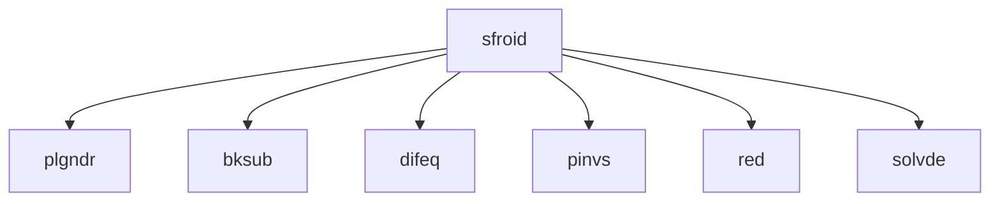

# SFROID -- Boundary Value Problems

## 1. Overview

| Field | Value |
|-------|-------|
| **Example** | `sfroid` |
| **Chapter** | 17 -- Boundary Value Problems |
| **Purpose** | Solve the spheroidal wave equation BVP by relaxation. |
| **Status** | `not_started` |
| **Complexity** | `high` |
| **Fortran LOC** | 57 |
| **Subroutine** | `(none)` (N/A) |

## 2. Source Files

- **Fortran source:** `fortran/17_boundary_value_problems/sfroid/sfroid.f` (57 lines)
- **Driver/demo:** _(none -- library-only or program-in-.f)_
- **Target:** `matarized/17_boundary_value_problems/sfroid/`


## 3. Dependency Graph

### Forward Dependencies (this example depends on)

  - `plgndr` (06_special_functions)
  - `bksub` (17_boundary_value_problems)
  - `difeq` (17_boundary_value_problems)
  - `pinvs` (17_boundary_value_problems)
  - `red` (17_boundary_value_problems)
  - `solvde` (17_boundary_value_problems)

### Diagram



### Cross-Chapter Dependencies

- `plgndr` from chapter 06

## 4. Reverse Dependencies (examples that depend on this)

  (none)

> **Conversion note:** No other examples depend on this routine.

## 5. Fortran Variable Catalog

| Name | Fortran Type | Shape | Role | MATAR Type | Notes |
|------|-------------|-------|------|-----------|-------|
| `C` | `REAL` | NCI, NCJ, NCK | local | `DFMatrixKokkos<double>(NCI, NCJ, NCK)` |  |
| `INDEXV` | `INTEGER` | NE | local | `DFMatrixKokkos<int>(NE)` |  |
| `M` | `INTEGER` | (scalar) | constant | `constexpr int M = 41;` | constant = 41 |
| `NB` | `INTEGER` | (scalar) | constant | `constexpr int NB = 1;` | constant = 1 |
| `NCI` | `INTEGER` | (scalar) | constant | `constexpr int NCI = NE;` | constant = NE |
| `NCJ` | `INTEGER` | (scalar) | constant | `constexpr int NCJ = NE-NB+1;` | constant = NE-NB+1 |
| `NCK` | `INTEGER` | (scalar) | constant | `constexpr int NCK = M+1;` | constant = M+1 |
| `NE` | `INTEGER` | (scalar) | constant | `constexpr int NE = 3;` | constant = 3 |
| `NSI` | `INTEGER` | (scalar) | constant | `constexpr int NSI = NE;` | constant = NE |
| `NSJ` | `INTEGER` | (scalar) | constant | `constexpr int NSJ = 2*NE+1;` | constant = 2*NE+1 |
| `NYJ` | `INTEGER` | (scalar) | constant | `constexpr int NYJ = NE;` | constant = NE |
| `NYK` | `INTEGER` | (scalar) | constant | `constexpr int NYK = M;` | constant = M |
| `S` | `REAL` | NSI, NSJ | local | `DFMatrixKokkos<double>(NSI, NSJ)` |  |
| `SCALV` | `REAL` | NE | local | `DFMatrixKokkos<double>(NE)` |  |
| `Y` | `REAL` | NE, M | local | `DFMatrixKokkos<double>(NE, M)` |  |

### MATAR Type Mapping Rationale

- **Layout:** `FMatrix` (column-major) preserves Fortran memory layout for correctness.
- **Index base:** `Matrix` (1-based) matches Fortran indexing with `DO_ALL` inclusive ranges.
- **Residence:** `Dual` (`DFMatrixKokkos`) enables both host I/O and device computation.
- **Ownership:** Owning types at call site; consider `ViewFMatrix` for sub-array slices.

## 6. Compute Kernel Analysis

### K1: DO 11  I=1,MM  (mesh point setup)

- **Thread safety:** `safe`
- **Recommended macro:** `DO_ALL`
- **Notes:** Initializes mesh points X(I) and initial guess Y(J,I). Each I is independent. The writes to INDEXV, SCALV are at matching indices. Parallelizable.

### K2: DO 12  K=1,M-1  (iteration refinement loop)

- **Thread safety:** `inherently_serial`
- **Recommended macro:** _serial `for` loop_
- **Notes:** This is the iterative relaxation loop. Each iteration calls `solvde` which solves a banded system on the current mesh. The solution at iteration K feeds into iteration K+1. Must remain serial. The internal banded solver (`solvde`, `bksub`, `pinvs`, `red`) may have parallelizable inner loops but the outer relaxation is sequential.


### Thread-Safety Legend

| Classification | Meaning | Action |
|---------------|---------|--------|
| `safe` | No write conflicts | Parallelize directly with `DO_ALL` |
| `reduction` | Accumulation to scalar | Use `DO_REDUCE_SUM` / `DO_REDUCE_MAX` |
| `unsafe_review` | Potential race condition | Restructure: inner serial loop or phased approach |
| `inherently_serial` | Sequential data dependency | Keep as serial `for` inside parallel region |

## 7. Conversion Strategy

### Proposed C++ Signature

```cpp
inline void sfroid(/* parameters */)
```

### Output Format

- **.cpp with main()** (standalone executable)

### Steps

1. **Translate data structures** -- replace Fortran arrays with `DFMatrixKokkos` (see variable catalog below)
2. **Translate routine** -- convert `SFROID` to a C++ function as a `.cpp with main()`
3. **Replace loops** -- convert DO loops to `DO_ALL` / `DO_REDUCE_*` macros (see kernel analysis below)
4. **Add synchronization** -- insert `MATAR_FENCE()` between dependent kernels; add `update_host()`/`update_device()` for Dual types
6. **Generate CMakeLists.txt** -- use the template below (based on convlv reference)
7. **Validate** -- follow the validation plan below

## 8. CMake Configuration

Based on the [convlv CMakeLists.txt](../../13_spectral_analysis/convlv/CMakeLists.txt) reference template.

```cmake
cmake_minimum_required(VERSION 3.18)
project(sfroid_matar_parallel CXX)

set(CMAKE_CXX_STANDARD 17)
set(CMAKE_CXX_STANDARD_REQUIRED ON)

include(FetchContent)

# --- Kokkos backend selection (Serial is always on) ---
set(Kokkos_ENABLE_SERIAL ON CACHE BOOL "Enable Kokkos serial backend")

option(ENABLE_OPENMP "Enable OpenMP backend" OFF)
option(ENABLE_CUDA   "Enable CUDA backend"   OFF)
option(ENABLE_HIP    "Enable HIP backend"    OFF)

if(ENABLE_OPENMP)
    set(Kokkos_ENABLE_OPENMP ON CACHE BOOL "")
endif()
if(ENABLE_CUDA)
    set(Kokkos_ENABLE_CUDA        ON CACHE BOOL "")
    set(Kokkos_ENABLE_CUDA_LAMBDA ON CACHE BOOL "")
endif()
if(ENABLE_HIP)
    set(Kokkos_ENABLE_HIP ON CACHE BOOL "")
endif()

# --- Fetch Kokkos ---
FetchContent_Declare(
    kokkos
    GIT_REPOSITORY https://github.com/kokkos/kokkos.git
    GIT_TAG        4.5.01
    GIT_SHALLOW    TRUE
)
FetchContent_MakeAvailable(kokkos)

# --- Fetch MATAR (header-only -- bypass its CMakeLists.txt) ---
FetchContent_Declare(
    matar
    GIT_REPOSITORY https://github.com/lanl/MATAR.git
    GIT_TAG        main
    GIT_SHALLOW    TRUE
)
FetchContent_GetProperties(matar)
if(NOT matar_POPULATED)
    FetchContent_Populate(matar)
endif()

add_library(matar_lib INTERFACE)
target_include_directories(matar_lib INTERFACE ${matar_SOURCE_DIR}/src/include)
target_link_libraries(matar_lib INTERFACE Kokkos::kokkos)
target_compile_definitions(matar_lib INTERFACE HAVE_KOKKOS=1)

# --- Cross-chapter dependency headers ---
set(MATARIZED_ROOT ${CMAKE_CURRENT_SOURCE_DIR}/../..)
set(SPECIALFUNCTIONS_DIR ${MATARIZED_ROOT}/06_special_functions)
set(BOUNDARYVALUEPROBLEMS_DIR ${MATARIZED_ROOT}/17_boundary_value_problems)

# --- Build the SFROID example ---
add_executable(sfroid main.cpp)
target_link_libraries(sfroid matar_lib)
target_include_directories(sfroid PRIVATE
    ${SPECIALFUNCTIONS_DIR}/plgndr
    ${BOUNDARYVALUEPROBLEMS_DIR}/bksub
    ${BOUNDARYVALUEPROBLEMS_DIR}/difeq
    ${BOUNDARYVALUEPROBLEMS_DIR}/pinvs
    ${BOUNDARYVALUEPROBLEMS_DIR}/red
    ${BOUNDARYVALUEPROBLEMS_DIR}/solvde
)
```

## 9. Performance Improvements

- **FMatrix to CArray migration:** The initial translation uses `DFMatrixKokkos` (column-major, 1-based) for Fortran compatibility.  For GPU targets, converting to `DCArrayKokkos` (row-major, 0-based) with reordered loops will improve coalesced memory access.
- **Loop ordering:** Verify innermost parallel index matches the fastest-varying array dimension for the chosen layout.
- **Fence elimination:** After conversion, audit `MATAR_FENCE()` placement.  Remove fences between independent kernels that do not share data.

## 10. Validation Plan

### Reference Output

_No standalone Fortran driver (.dem) exists.  Validate by calling this routine from a dependent example._


### Serial Validation

```bash
cd matarized/17_boundary_value_problems/sfroid
mkdir -p build && cd build
cmake .. && make
./sfroid > serial_output.txt 2>&1
diff <(head -50 serial_output.txt) <(head -50 ../../../../fortran/17_boundary_value_problems/sfroid/reference_output.txt)
```


### Parallel Validation (OpenMP)

```bash
cd matarized/17_boundary_value_problems/sfroid
mkdir -p build-omp && cd build-omp
cmake .. -DENABLE_OPENMP=ON && make
OMP_NUM_THREADS=1 ./sfroid > omp1_output.txt 2>&1
OMP_NUM_THREADS=4 ./sfroid > omp4_output.txt 2>&1
# Verify: omp1 output must exactly match serial output
diff serial_output.txt omp1_output.txt
# Verify: omp4 output must match within floating-point tolerance
```


### Pass Criteria

- Max absolute difference vs. Fortran reference: **< 1e-10** (double precision)

- OpenMP results must be deterministic across repeated runs

- No runtime errors, memory leaks, or Kokkos warnings


## 11. Agent Metadata

| Field | Value |
|-------|-------|
| **Conversion order** | 193 of 202 |
| **Priority score** | 0 (reverse dependency count) |
| **Estimated effort** | high (57 Fortran LOC, 6 dependencies) |
| **Prerequisite conversions** | `plgndr`, `bksub`, `difeq`, `pinvs`, `red`, `solvde` |
| **Tags** | `boundary-value`, `differential-equation`, `cross-chapter` |
| **MATAR reference sections** | Sec 5 (parallel loops) |
