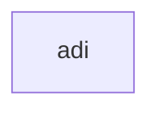

# ADI -- Partial Differential Equations

## 1. Overview

| Field | Value |
|-------|-------|
| **Example** | `adi` |
| **Chapter** | 19 -- Partial Differential Equations |
| **Purpose** | Alternating Direction Implicit method for 2D parabolic/elliptic PDEs. |
| **Status** | `not_started` |
| **Complexity** | `high` |
| **Fortran LOC** | 87 |
| **Subroutine** | `ADI` (subroutine) |

## 2. Source Files

- **Fortran source:** `fortran/19_partial_differential_equations/adi/adi.f` (87 lines)
- **Driver/demo:** `fortran/19_partial_differential_equations/adi/adi.dem`
- **Target:** `matarized/19_partial_differential_equations/adi/`


## 3. Dependency Graph

### Forward Dependencies (this example depends on)

  (none)

### Diagram



### Cross-Chapter Dependencies

(none)

## 4. Reverse Dependencies (examples that depend on this)

  (none)

> **Conversion note:** No other examples depend on this routine.

## 5. Fortran Variable Catalog

| Name | Fortran Type | Shape | Role | MATAR Type | Notes |
|------|-------------|-------|------|-----------|-------|
| `A` | `REAL*8` | JMAX, JMAX | parameter (input) | `DFMatrixKokkos<double>(JMAX, JMAX)` |  |
| `AA` | `REAL*8` | JJ | local | `DFMatrixKokkos<double>(JJ)` |  |
| `ALPH` | `REAL*8` | KK | local | `DFMatrixKokkos<double>(KK)` |  |
| `ALPHA` | `REAL*8` | (scalar) | parameter (input) | `double` |  |
| `B` | `REAL*8` | JMAX, JMAX | parameter (input) | `DFMatrixKokkos<double>(JMAX, JMAX)` |  |
| `BB` | `REAL*8` | JJ | local | `DFMatrixKokkos<double>(JJ)` |  |
| `BET` | `REAL*8` | KK | local | `DFMatrixKokkos<double>(KK)` |  |
| `BETA` | `REAL*8` | (scalar) | parameter (input) | `double` |  |
| `C` | `REAL*8` | JMAX, JMAX | parameter (input) | `DFMatrixKokkos<double>(JMAX, JMAX)` |  |
| `CC` | `REAL*8` | JJ | local | `DFMatrixKokkos<double>(JJ)` |  |
| `D` | `REAL*8` | JMAX, JMAX | parameter (input) | `DFMatrixKokkos<double>(JMAX, JMAX)` |  |
| `E` | `REAL*8` | JMAX, JMAX | parameter (input) | `DFMatrixKokkos<double>(JMAX, JMAX)` |  |
| `EPS` | `REAL*8` | (scalar) | parameter (input) | `double` |  |
| `F` | `REAL*8` | JMAX, JMAX | parameter (input) | `DFMatrixKokkos<double>(JMAX, JMAX)` |  |
| `G` | `REAL*8` | JMAX, JMAX | parameter (input) | `DFMatrixKokkos<double>(JMAX, JMAX)` |  |
| `HALF` | `REAL*8` | (scalar) | constant | `constexpr double HALF = .5 D0;` | constant = .5 D0 |
| `JJ` | `INTEGER` | (scalar) | constant | `constexpr int JJ = 100;` | constant = 100 |
| `JMAX` | `INTEGER` | (scalar) | parameter (input) | `int` |  |
| `K` | `INTEGER` | (scalar) | parameter (input) | `int` |  |
| `KK` | `INTEGER` | (scalar) | constant | `constexpr int KK = 6;` | constant = 6 |
| `MAXITS` | `INTEGER` | (scalar) | constant | `constexpr int MAXITS = 100;` | constant = 100 |
| `NRR` | `INTEGER` | (scalar) | constant | `constexpr int NRR = 32;` | constant = 32 |
| `PSI` | `REAL*8` | JJ, JJ | local | `DFMatrixKokkos<double>(JJ, JJ)` |  |
| `R` | `REAL*8` | NRR | local | `DFMatrixKokkos<double>(NRR)` |  |
| `RR` | `REAL*8` | JJ | local | `DFMatrixKokkos<double>(JJ)` |  |
| `S` | `REAL*8` | NRR, KK | local | `DFMatrixKokkos<double>(NRR, KK)` |  |
| `TWO` | `REAL*8` | (scalar) | constant | `constexpr double TWO = 2.D0;` | constant = 2.D0 |
| `U` | `REAL*8` | JMAX, JMAX | parameter (input) | `DFMatrixKokkos<double>(JMAX, JMAX)` |  |
| `UU` | `REAL*8` | JJ | local | `DFMatrixKokkos<double>(JJ)` |  |
| `ZERO` | `REAL*8` | (scalar) | constant | `constexpr double ZERO = 0.D0;` | constant = 0.D0 |

### MATAR Type Mapping Rationale

- **Layout:** `FMatrix` (column-major) preserves Fortran memory layout for correctness.
- **Index base:** `Matrix` (1-based) matches Fortran indexing with `DO_ALL` inclusive ranges.
- **Residence:** `Dual` (`DFMatrixKokkos`) enables both host I/O and device computation.
- **Ownership:** Owning types at call site; consider `ViewFMatrix` for sub-array slices.

## 6. Compute Kernel Analysis

### ADI Algorithm Structure

The Alternating Direction Implicit method has this structure:
1. **Outer iteration loop** (DO 27 KITS=1,NITS) -- inherently serial (convergence)
2. **X-direction half-step** (DO 16 J / DO 15 L): Form and solve tridiagonal systems along each row
3. **Y-direction half-step** (DO 23 J / DO 21 L): Form and solve tridiagonal systems along each column
4. **Convergence check** (ANORM accumulation) -- reduction

### K1: DO 11/13 J=1,K  (timestep parameter setup)

- **Thread safety:** `inherently_serial`
- **Recommended macro:** _serial `for` loop_
- **Notes:** Computes the cyclic ADI timestep parameters (ALPH, BET arrays). Small fixed-size loops (K = log2(N_periods)), not worth parallelizing.

### K2: DO 27  KITS=1,NITS  (OUTER ITERATION LOOP)

- **Thread safety:** `inherently_serial`
- **Recommended macro:** _serial `for` or `while` loop_
- **Notes:** Each ADI iteration depends on the previous one's solution. Must remain serial.

### K3: DO 16 J=2,JMAX-1 / DO 15 L=2,JMAX-1  (X-DIRECTION SWEEP)

- **Thread safety:** `safe` at the row level
- **Recommended macro:** `DO_ALL` over rows (J), serial tridiagonal solve within each row
- **Notes:** Each row J forms an independent tridiagonal system along L. **Strategy:** Parallelize over rows with `DO_ALL(J=2, JMAX-1, ...)`. Within each thread, solve the tridiagonal system for that row serially using Thomas algorithm. The ANORM accumulation is a `DO_REDUCE_SUM`. ALPH, BET, S are workspace arrays that should be per-thread (thread-local or indexed by J).

### K4: DO 23 J=2,JMAX-1 / DO 21 L=2,JMAX-1  (Y-DIRECTION SWEEP)

- **Thread safety:** `safe` at the column level
- **Recommended macro:** `DO_ALL` over columns (L), serial tridiagonal solve within each column
- **Notes:** Symmetric to K3 but sweeping in the Y direction. Each column L is independent. **Strategy:** `DO_ALL(L=2, JMAX-1, ...)` with per-thread Thomas solve. The workspace arrays ALPH, BET, S need to be per-thread.

### K5: DO 24 N=1,NR (timestep cycling)

- **Thread safety:** `inherently_serial`
- **Recommended macro:** _serial `for` loop_
- **Notes:** Cycles through the ADI timestep parameters. Small loop (NR timestep parameters), not worth parallelizing.

### K6: Convergence check (ANORM accumulation)

- **Thread safety:** `reduction`
- **Recommended macro:** `DO_REDUCE_SUM` or `DO_REDUCE_MAX`
- **Notes:** ANORM and ANORMG accumulate over the 2D interior grid. Use a 2D `DO_REDUCE_SUM` or flatten to 1D.

### Important: Per-Thread Workspace

The ADI tridiagonal solves use workspace arrays ALPH(JMAX), BET(JMAX), S(JMAX). When parallelizing the row/column sweeps, each thread needs its own copy. Options:
1. Allocate workspace as 2D arrays indexed by (thread_dimension, solve_dimension)
2. Use `Kokkos::ScratchMemorySpace` for team-level scratch
3. Flatten into the parallel dispatch: `DFMatrixKokkos<double>(JMAX-2, JMAX)` where first index is the parallel row/column

### K16: DO 25  L=2,JMAX-1

- **Thread safety:** `unsafe_review`
- **Recommended macro:** `DO_REDUCE_SUM`
- **Notes:** Accumulates: ANORM, ANORMG Array write(s) not indexed by loop variable: ALPH, BET, S. Verify thread safety.


### Thread-Safety Legend

| Classification | Meaning | Action |
|---------------|---------|--------|
| `safe` | No write conflicts | Parallelize directly with `DO_ALL` |
| `reduction` | Accumulation to scalar | Use `DO_REDUCE_SUM` / `DO_REDUCE_MAX` |
| `unsafe_review` | Potential race condition | Restructure: inner serial loop or phased approach |
| `inherently_serial` | Sequential data dependency | Keep as serial `for` inside parallel region |

## 7. Conversion Strategy

### Proposed C++ Signature

```cpp
inline void adi(DFMatrixKokkos<double>& a, DFMatrixKokkos<double>& b, DFMatrixKokkos<double>& c, DFMatrixKokkos<double>& d, DFMatrixKokkos<double>& e, DFMatrixKokkos<double>& f, DFMatrixKokkos<double>& g, DFMatrixKokkos<double>& u, int jmax, int k, double alpha, double beta, double eps)
```

### Output Format

- **.cpp with main()** (standalone executable)

### Steps

1. **Translate data structures** -- replace Fortran arrays with `DFMatrixKokkos` (see variable catalog below)
2. **Translate routine** -- convert `ADI` to a C++ function as a `.cpp with main()`
3. **Replace loops** -- convert DO loops to `DO_ALL` / `DO_REDUCE_*` macros (see kernel analysis below)
4. **Add synchronization** -- insert `MATAR_FENCE()` between dependent kernels; add `update_host()`/`update_device()` for Dual types
5. **Create driver** -- translate the `.dem` test program to `main.cpp` with `MATAR_INITIALIZE` / `MATAR_FINALIZE` boilerplate
6. **Generate CMakeLists.txt** -- use the template below (based on convlv reference)
7. **Validate** -- follow the validation plan below

## 8. CMake Configuration

Based on the [convlv CMakeLists.txt](../../13_spectral_analysis/convlv/CMakeLists.txt) reference template.

```cmake
cmake_minimum_required(VERSION 3.18)
project(adi_matar_parallel CXX)

set(CMAKE_CXX_STANDARD 17)
set(CMAKE_CXX_STANDARD_REQUIRED ON)

include(FetchContent)

# --- Kokkos backend selection (Serial is always on) ---
set(Kokkos_ENABLE_SERIAL ON CACHE BOOL "Enable Kokkos serial backend")

option(ENABLE_OPENMP "Enable OpenMP backend" OFF)
option(ENABLE_CUDA   "Enable CUDA backend"   OFF)
option(ENABLE_HIP    "Enable HIP backend"    OFF)

if(ENABLE_OPENMP)
    set(Kokkos_ENABLE_OPENMP ON CACHE BOOL "")
endif()
if(ENABLE_CUDA)
    set(Kokkos_ENABLE_CUDA        ON CACHE BOOL "")
    set(Kokkos_ENABLE_CUDA_LAMBDA ON CACHE BOOL "")
endif()
if(ENABLE_HIP)
    set(Kokkos_ENABLE_HIP ON CACHE BOOL "")
endif()

# --- Fetch Kokkos ---
FetchContent_Declare(
    kokkos
    GIT_REPOSITORY https://github.com/kokkos/kokkos.git
    GIT_TAG        4.5.01
    GIT_SHALLOW    TRUE
)
FetchContent_MakeAvailable(kokkos)

# --- Fetch MATAR (header-only -- bypass its CMakeLists.txt) ---
FetchContent_Declare(
    matar
    GIT_REPOSITORY https://github.com/lanl/MATAR.git
    GIT_TAG        main
    GIT_SHALLOW    TRUE
)
FetchContent_GetProperties(matar)
if(NOT matar_POPULATED)
    FetchContent_Populate(matar)
endif()

add_library(matar_lib INTERFACE)
target_include_directories(matar_lib INTERFACE ${matar_SOURCE_DIR}/src/include)
target_link_libraries(matar_lib INTERFACE Kokkos::kokkos)
target_compile_definitions(matar_lib INTERFACE HAVE_KOKKOS=1)

# --- Cross-chapter dependency headers ---
set(MATARIZED_ROOT ${CMAKE_CURRENT_SOURCE_DIR}/../..)


# --- Build the ADI example ---
add_executable(adi main.cpp)
target_link_libraries(adi matar_lib)

```

## 9. Performance Improvements

- **FMatrix to CArray migration:** The initial translation uses `DFMatrixKokkos` (column-major, 1-based) for Fortran compatibility.  For GPU targets, converting to `DCArrayKokkos` (row-major, 0-based) with reordered loops will improve coalesced memory access.
- **Loop ordering:** Verify innermost parallel index matches the fastest-varying array dimension for the chosen layout.
- **Reduction fusion:** If multiple reductions share the same loop bounds, consider fusing them into a single pass to reduce kernel launch overhead.
- **Fence elimination:** After conversion, audit `MATAR_FENCE()` placement.  Remove fences between independent kernels that do not share data.
- **Hierarchical parallelism:** For deeply nested loops, consider `FOR_FIRST`/`FOR_SECOND` team-thread decomposition for better occupancy.

## 10. Validation Plan

### Reference Output

Build and run the Fortran version to capture reference output:

```bash
cd fortran/19_partial_differential_equations/adi
make run > reference_output.txt 2>&1
```


### Serial Validation

```bash
cd matarized/19_partial_differential_equations/adi
mkdir -p build && cd build
cmake .. && make
./adi > serial_output.txt 2>&1
diff <(head -50 serial_output.txt) <(head -50 ../../../../fortran/19_partial_differential_equations/adi/reference_output.txt)
```


### Parallel Validation (OpenMP)

```bash
cd matarized/19_partial_differential_equations/adi
mkdir -p build-omp && cd build-omp
cmake .. -DENABLE_OPENMP=ON && make
OMP_NUM_THREADS=1 ./adi > omp1_output.txt 2>&1
OMP_NUM_THREADS=4 ./adi > omp4_output.txt 2>&1
# Verify: omp1 output must exactly match serial output
diff serial_output.txt omp1_output.txt
# Verify: omp4 output must match within floating-point tolerance
```


### Pass Criteria

- Max absolute difference vs. Fortran reference: **< 1e-10** (double precision)

- OpenMP results must be deterministic across repeated runs

- No runtime errors, memory leaks, or Kokkos warnings


## 11. Agent Metadata

| Field | Value |
|-------|-------|
| **Conversion order** | 100 of 202 |
| **Priority score** | 0 (reverse dependency count) |
| **Estimated effort** | high (87 Fortran LOC, 0 dependencies) |
| **Prerequisite conversions** | (none -- leaf node) |
| **Tags** | `pde`, `differential-equation`, `stencil`, `leaf` |
| **MATAR reference sections** | Sec 5 (parallel loops), Sec 6 (reductions), Sec 15 (Fortran interop) |
